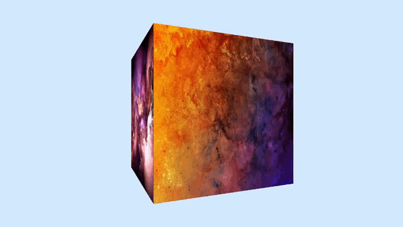

# Cube

Cube is a programme that draws a rotating cube in three-dimensional space, with different textures on each face. It is
also possible to move around in this space.

## Content

- [Intro](#intro)
- [Getting started](#getting-started)
    - [Installation](#installation)
- [Running the app](#running-the-app)
- [Project usage](#project-usage)

## Intro

The project was written as part of the Computer Graphics laboratory work.

See how the app works in a gif below.

  

## Getting started

### Installation

Clone the repository

    git clone https://github.com/qtenebrae/rotating-cube.git

Switch to the repo folder

    cd rotating-cube

Installing dependencies

    pip install -r requirements.txt

## Running the app

To run the application, you need to write a script:

    python .\src\main.py

To run the tests, it is sufficient to write the following:

    pytest

## Project usage

Once you launch the app you will see a rotating cube in front of you.

You can move around in three-dimensional space and view the cube from different angles.

Use the mouse to change the direction of the player's view.

It is possible to move in space using the `w`, `a`, `s` and `d` keys to move `forwards`, `left`, `backwards` and `right`
respectively.

It is also possible to move `up` and `down` using the `space` and `shift` keys.
